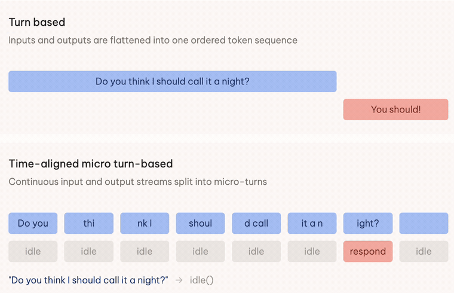

# Text GPT-Live



A small language model trained to act *while* you type, instead of waiting for
you to finish.

Every 650 ms the browser sends the current contents of the textbox. The model
reads that stream — including pauses, corrections, and an empty box — and
predicts exactly one action: stay silent, reply, highlight a word, translate a
committed clause, start a background task, or run a search. Nothing in the
runtime decides whether the user has finished talking. The model does.

- **Write-up:** [Can you train a GPT-Live for $50?](https://huyxdang.com/text-gpt-live)
- **Model:** [huyxdang/text-gpt-live](https://huggingface.co/huyxdang/text-gpt-live)
- **Dataset:** [huyxdang/text-gpt-live-dataset](https://huggingface.co/datasets/huyxdang/text-gpt-live-dataset)

Base model is `Qwen/Qwen3.5-4B` with a rank-32 LoRA, trained in three
sequential SFT stages on [Tinker](https://thinkingmachines.ai/tinker/). All
three stages cost about $50.

## Contents

- [The action grammar](#the-action-grammar)
- [Run the app](#run-the-app)
- [Reproduce the dataset](#reproduce-the-dataset)
- [Train](#train)
- [Layout](#layout)
- [What is not in this repo](#what-is-not-in-this-repo)
- [License](#license)

## The action grammar

The model emits one line per tick, from a closed set of seven verbs enforced
by `app/stream.py`:

| Action | Meaning | First trained | Demo |
| --- | --- | --- | --- |
| `idle()` | stay silent | stage 1 | all |
| `respond({...})` | reply, acknowledge, or fire a reminder | stage 1 | all |
| `delegate({...})` | hand a slow task to a background model | stage 1 | concurrent tool calls |
| `highlight({...})` | mark a specific occurrence of a word | stage 1 | — |
| `suggest_edit({...})` | replace an exact span in the current text | stage 1 | — |
| `translate_commit({...})` | append a stable unit of translation mid-sentence | stage 2 | live translation |
| `web_search({...})` | issue a query; results arrive as a later event | stage 2 | concurrent tool calls |

`idle()` is the default and by far the most common correct answer — **68.5%
of stage-1 targets**. Most moments in a live interaction should not trigger
anything, so learning when to stay quiet is the first thing the model has to
get right.

`highlight` and `suggest_edit` are trained (255 and 151 stage-1 cards) and the
runtime will execute them, but no demo in the write-up exercises them.

Note that stage 1 performs translation through `respond` — `translate_commit`
and `web_search` do not appear in the corpus until stage 2.

Because the set is closed, every prediction can be validated and executed
without putting any interaction policy in the runtime. The runtime never
decides whether the user has finished, whether to interrupt, or whether to
stay quiet; it only carries out the action the model emitted.

## Run the app

Python 3.11+.

```bash
python3 -m venv .venv
.venv/bin/python -m pip install -r requirements-tinker.txt
cp .env.example .env      # set TINKER_API_KEY
POLICY_PROMPT=g1 .venv/bin/python -m uvicorn app.main:app --reload
```

Open <http://127.0.0.1:8000>. To serve the released weights locally instead of
through Tinker, download the model from Hugging Face and set:

```bash
export POLICY_MODE=local
export SMOL_LOCAL_MODEL=models/text-gpt-live-mlx-8bit
```

If no model is reachable the UI stays open and says **No model available** —
it never quietly substitutes a fallback.

## Reproduce the dataset

The authored source records are in [`data/g1_authored/`](data/g1_authored) —
42 JSON files across five demos. These are the *inputs*, not the training
cards. Authoring models wrote scenarios under a fixed schema; a deterministic
compiler turns each one into a 650 ms event stream and assigns every target.
No model judges anything, and the validators reject any authored text that
contains action syntax.

```bash
.venv/bin/python -m scripts.g1_full_build
```

This validates all five demos against their distribution gates, compiles them,
removes exact duplicate prompt/answer pairs globally, and requires zero prompt
overlap between train and dev. On a clean checkout it produces:

```
g1 full: 6688 rows from 6740 inputs (train=6013, dev=675)
Resolved 42 duplicate prompt groups; removed 47 exact duplicates; train/dev overlap=0
Tinker limit: removed 5 rows above 65536 target tokens; max published=62223
```

Those are the numbers in the write-up.

All three stages are also published on Hugging Face if you would rather not
rebuild them. Train them in this order, each resuming from the previous
checkpoint:

| Stage | Cards | Teaches | On Hugging Face as |
| ---: | ---: | --- | --- |
| 1 | 6,013 | core interaction behaviour — when to stay silent, speak, highlight, delegate | `stage1_train.jsonl` |
| 2 | 2,903 | translation and web search | `train.jsonl` |
| 3 | 544 | repairs for failures found in evaluation | `delivery_repair_train.jsonl` |

The dev sets are deliberately not published, so held-out evaluation stays
independent. `scripts.g1_full_build` regenerates stage 1's dev split (675
cards) locally.

## Train

Training runs on [Tinker](https://thinkingmachines.ai/tinker/), Thinking
Machines Lab's managed LoRA service — **you need an account and a
`TINKER_API_KEY` to reproduce this step.** Tinker abstracts the GPUs, the
distributed step, and checkpoint storage; every hyperparameter is set by this
repo and stamped into each run's report, so no forgotten flag can pass itself
off as the recipe.

```bash
.venv/bin/python -m train.tinker_run --stage g1
```

All three stages together cost about $50.

Each stage resumes from the previous checkpoint at a lower learning rate
(2e-4, 5e-5, 1e-5). The full locked configuration — rank 32, adapter seed 650,
optimizer settings, per-stage step counts — is in
[`docs/training.md`](docs/training.md).

Nothing here is Tinker-specific beyond the client: the corpus is plain JSONL
of `prompt` / `completion` pairs, so any LoRA trainer that reads that format
can substitute.

## Layout

```
app/          runtime, policy, stream format, search, background delegation
datagen/      authored-record validators and the deterministic compilers
train/        Tinker training loop and evaluation
scripts/      build, eval, probe, and local-serving entry points
tests/        distribution gates and contract tests
static/       the browser client that ticks every 650 ms
data/         authored source records
docs/         architecture, data spec, training recipe
```

`app/stream.py` is worth reading first. Training and serving compile prompts
through the same `compile_stream`, so a reproduction cannot silently diverge
from what the model was trained on.

## What is not in this repo

- **Weights** — on Hugging Face. `models/` is gitignored.
- **Compiled training cards** — all three stages are on Hugging Face, and
  stage 1 also rebuilds from `data/g1_authored` with the command above.
  `data/**/*.jsonl` is gitignored.

## License

MIT. See [LICENSE](LICENSE).
